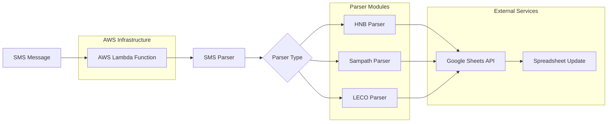

# Auto Finance

A serverless Go application that automates financial operations by processing SMS messages and updating Google Sheets. Designed to run on AWS Lambda, it provides seamless integration between SMS notifications from banks and utility providers with spreadsheet-based financial tracking.

## Features

- **SMS Message Processing**: Automatically parses SMS messages from banking institutions and utility providers
- **Google Sheets Integration**: Real-time updates to Google Sheets for financial tracking and reporting
- **Multi-Bank Support**: Built-in parsers for HNB and Sampath Bank SMS formats
- **Utility Bill Processing**: Support for LECO (Lanka Electricity Company) bill notifications
- **AWS Lambda Ready**: Serverless architecture with minimal infrastructure requirements
- **Secure Configuration**: Uses AWS Parameter Store for sensitive credentials
- **Structured Logging**: Comprehensive logging with structured output using Zerolog
- **AWS S3 Configuration**: Configuration files stored securely in S3 buckets

## Architecture



### Data Flow
1. **SMS Reception**: Banking/utility SMS messages are received by the Lambda function
2. **Message Parsing**: Specialized parsers extract relevant financial data based on message format
3. **Data Storage**: Parsed data is written to Google Sheets via the Sheets API
4. **Real-time Updates**: Spreadsheets are updated immediately for financial tracking

### Key Components

- **SMS Parsers**: Specialized parsers for different message formats
  - Banking: HNB (`internal/smsparser/banking/hnb/`)
  - Banking: Sampath (`internal/smsparser/banking/sampath/`)
  - Bills: LECO (`internal/smsparser/bill/leco/`)
- **Services**: Business logic for processing different types of financial data
- **Storage**: Google Sheets integration for data persistence
- **Configuration**: Centralized config management with AWS S3 and Parameter Store

## Prerequisites

- Go 1.24 or later
- AWS CLI configured with appropriate permissions
- Google Cloud Project with Sheets API enabled
- Service account credentials for Google Sheets API

## Installation

1. Clone the repository:

   ```bash
   git clone git@github-dilrandi:DiLRandI/auto-finance.git
   cd auto-finance
   ```

2. Install dependencies:

   ```bash
   go mod download
   ```

3. Set up AWS resources:

   ```bash
   make create-deployment-bucket
   ```

4. Build the application:

   ```bash
   make build
   ```

## Configuration

### Environment Variables

Set the following environment variables in your AWS Lambda function:

- `CONFIGURATION_BUCKET`: S3 bucket name for configuration files
- `LOG_LEVEL`: Logging level (info, debug, warn, error)
- `SHEET_KEY`: Parameter Store key for Google Sheets service account credentials

### Configuration File

Create a `config.toml` file and upload it to your S3 configuration bucket:

```toml
[leco_sheet_config]
sheet_id = "your-google-sheet-id"
sheet_name = "LECO Bills"
```

### Google Sheets Setup

1. Create a Google Cloud Project
2. Enable the Google Sheets API
3. Create a service account and download the JSON key
4. Store the JSON key content in AWS Parameter Store
5. Share your target spreadsheet with the service account email

## Usage

### Local Development

```bash
# Build for local testing
make build

# Run the application locally (requires AWS SAM CLI)
sam local invoke AutoFinanceFunction
```

### Deployment

```bash
# Deploy to AWS
make deploy

# View deployment information
make info
```

## Project Structure

```
auto-finance/
├── cmd/
│   ├── auto-finance/          # Main Lambda function entry point
│   └── terminal/              # Terminal-based testing utility
├── internal/
│   ├── app/                   # Application logic
│   ├── config/                # Configuration management
│   ├── logger/                # Structured logging
│   ├── models/                # Data models
│   ├── parameter-store/       # AWS Parameter Store integration
│   ├── service/               # Business logic services
│   ├── smsparser/             # SMS message parsers
│   │   ├── banking/           # Bank SMS parsers
│   │   └── bill/              # Utility bill parsers
│   └── storage/               # Data storage interfaces
├── config/                    # Configuration templates
├── deployment/                # AWS deployment templates
└── Makefile                   # Build and deployment automation
```

## API Reference

### SMS Message Format

The application expects SMS messages in specific formats for each supported service:

#### Banking SMS (HNB/Sampath)

```
HNB: "Transaction Alert: Rs.1,000.00 debited from A/C XXXX1234 on 2024-01-15 14:30:00"
Sampath: "Debit Alert: LKR 2,500.00 withdrawn from 1234567890 at ATM on 15/01/2024"
```

#### Utility Bill SMS (LECO)

```
"LECO Bill: Your account 1234567890 has a balance of Rs.5,000.00 due by 2024-01-31"
```

## Development

### Adding New SMS Parsers

1. Create a new parser in `internal/smsparser/`
2. Implement the `UniversalParser` interface
3. Register the parser in the message service configuration

### Testing

```bash
# Run tests
go test ./...

# Run specific parser tests
go test ./internal/smsparser/bill/leco/
```

## Deployment

The application uses AWS SAM for deployment and includes:

- Lambda function with ARM64 architecture
- IAM roles with minimal required permissions
- S3 bucket for configuration storage
- CloudFormation stack management

### Manual Deployment Steps

1. Build the application: `make build`
2. Copy configuration: `make copy-config`
3. Deploy with SAM: `make deploy`

## Monitoring

- CloudWatch Logs for application logs
- CloudWatch Metrics for Lambda performance
- X-Ray integration for distributed tracing (if enabled)

## Security

- Credentials stored in AWS Parameter Store
- Configuration files in private S3 buckets
- IAM roles with principle of least privilege
- Encrypted data in transit and at rest

## Contributing

1. Fork the repository
2. Create a feature branch (`git checkout -b feature/amazing-feature`)
3. Commit your changes (`git commit -m 'Add amazing feature'`)
4. Push to the branch (`git push origin feature/amazing-feature`)
5. Open a Pull Request

## Versioning

This project uses Git tags for versioning. The version is automatically injected during the build process:

```bash
# Create a new version tag
git tag v1.2.3
git push origin v1.2.3
```

## License

MIT License - see LICENSE file for details

## Support

For issues and questions:

- Create an issue in the GitHub repository
- Check existing documentation and examples
- Review CloudWatch logs for runtime issues

## Roadmap

- [ ] Support for additional banks and utility providers
- [ ] Webhook integration for real-time notifications
- [ ] Advanced financial analytics and reporting
- [ ] Multi-currency support
- [ ] Mobile app companion
